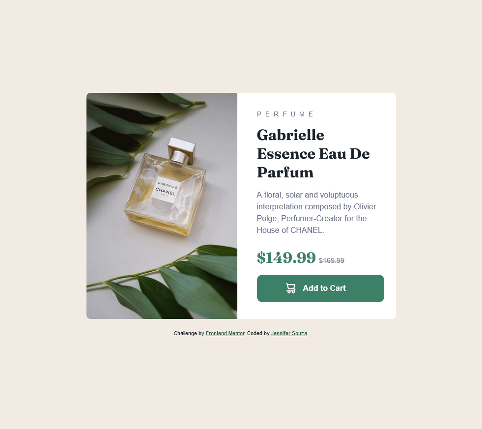

# Frontend Mentor - Product preview card component solution

This is a solution to the [Product preview card component challenge on Frontend Mentor](https://www.frontendmentor.io/challenges/product-preview-card-component-GO7UmttRfa). Frontend Mentor challenges help you improve your coding skills by building realistic projects. 

## Table of contents

- [Overview](#overview)
  - [The challenge](#the-challenge)
  - [Screenshot](#screenshot)
  - [Links](#links)
- [My process](#my-process)
  - [Built with](#built-with)
  - [What I learned](#what-i-learned)
  - [Continued development](#continued-development)
  - [Useful resources](#useful-resources)
- [Author](#author)

## Overview

### The challenge

Users should be able to:

- View the optimal layout depending on their device's screen size
- See hover and focus states for interactive elements

### Screenshot

### Links

- Solution URL: [https://github.com/zoedarkweather/product-preview-card-component](https://github.com/zoedarkweather/product-preview-card-component)
- Live Site URL: [https://product-preview-card-component-taupe-gamma.vercel.app/](https://product-preview-card-component-taupe-gamma.vercel.app/)

## My process

### Built with

- Semantic HTML5 markup
- CSS custom properties
- Flexbox
- CSS Grid
- Mobile-first workflow

### What I learned

I learned that you can use display flex to vertically align button text.

9/28 updates:
- Made some changes to the spacing and vertically centered the component on the page to better match design.
- Changed the strikethrough on the price from css to html so it can be correctly read by screenreaders. 
- Changed the button icon to a background image to improve accessibility of the button.
- Added the hover/focus state to the button which I'd forgotten to do
- Edited the product image alt tag to be more descriptive.
- Made the attribution section match the color-scheme, making sure it had a WCAG-passing contrast ratio.
- Tested the page with NVDA and used the Accessibility Inspector in FireFox Dev Tools to check for issues.

### Continued development

Keep learning and practicing everything.

### Useful resources

- [Stackoverflow - vertically align button text](https://stackoverflow.com/questions/5184856/html-vertical-align-the-text-inside-input-type-button) - The top answer on this one was to make the button display inline flex. I used that idea but made it flex instead.

## Author

- Github - [Jennifer Souza](https://github.com/zoedarkweather)
- Frontend Mentor - [@zoedarkweather](https://www.frontendmentor.io/profile/zoedarkweather)
